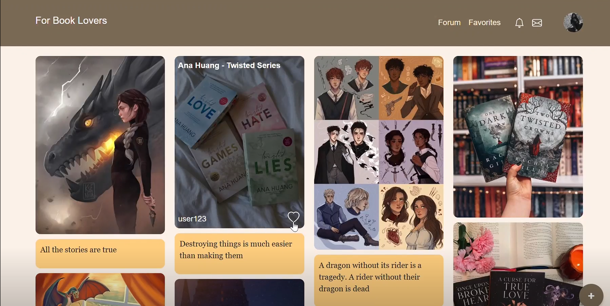
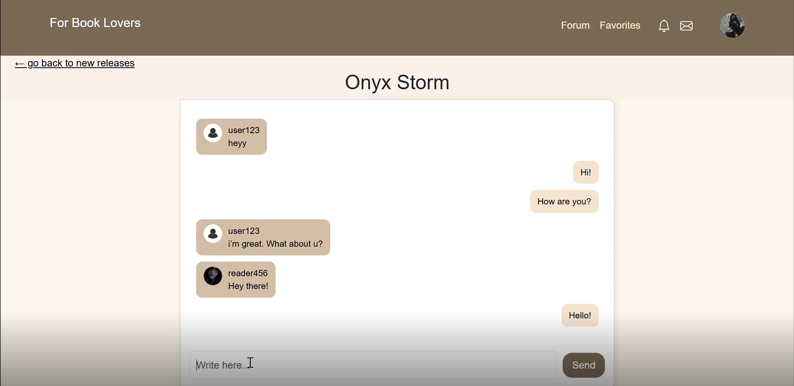
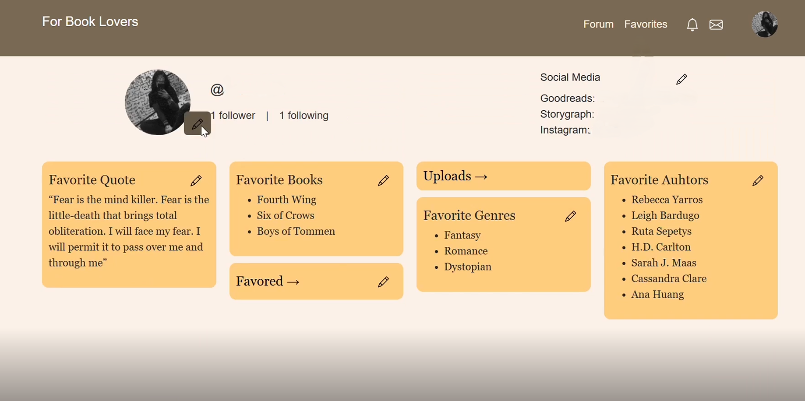
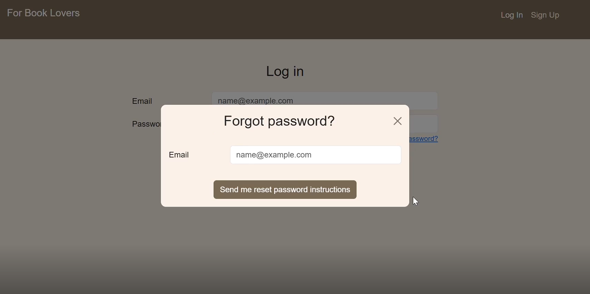

# Social Platform for Book Readers (Bachelor’s Project)

A front-end project developed as part of my bachelor’s thesis: *“Social Platform for Book Readers”*
This project focuses on creating an intuitive and engaging user interface for book enthusiasts to share thoughts, upload content, and connect with other readers.

---

## 🚀 Features

* 📚 Upload and manage book-related content (photos, notes)
* ✏️ Edit and delete posts for better content control
* 📱 Responsive design optimized for desktop and mobile
* 🎨 UI inspired by platforms such as Pinterest, Goodreads, and Fable

---

## 🛠️ Tech Stack

* **Frontend:** React.js, Bootstrap, HTML, CSS, JavaScript
* **Design:** Figma

---

## 📸 Screenshots

Example:





---

## 🔧 Installation & Setup

To run this project locally:

```bash
# Clone this repository
git clone https://github.com/YourUsername/social_plarform_for_book_readers.git

# Navigate into the project folder
cd social_platform_for_book_readers

# Install dependencies
npm install

# Start the development server
npm run dev
```

The app will be available at `http://localhost:5173/` (or as specified by Vite).

---

## 📖 Thesis Context

This project was developed as part of my bachelor’s thesis, analyzing UI/UX design principles of social platforms for readers.
Case studies included **Pinterest, Goodreads, and Fable**, with emphasis on interface usability, user experience, and responsive design.
Created website was only hosted localy.

---

## 📬 Contact

Developed by Junita Dabusinskaite

* LinkedIn: https://www.linkedin.com/in/junita-dabusinskaite-9a727b310/
* GitHub: https://github.com/junitadabusinskaite
* Figma project: https://www.figma.com/proto/VOw2aB5cCdJM8KOCFw8Kjy/Kursinis?node-id=33-31&p=f&m=draw&scaling=contain&content-scaling=fixed&page-id=31%3A2&starting-point-node-id=33%3A31&show-proto-sidebar=1&t=whtHmHf2RnJB2mzL-1


